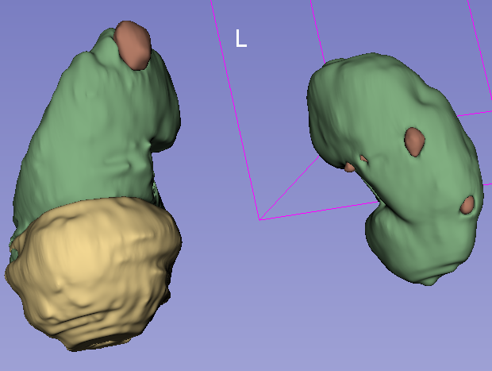
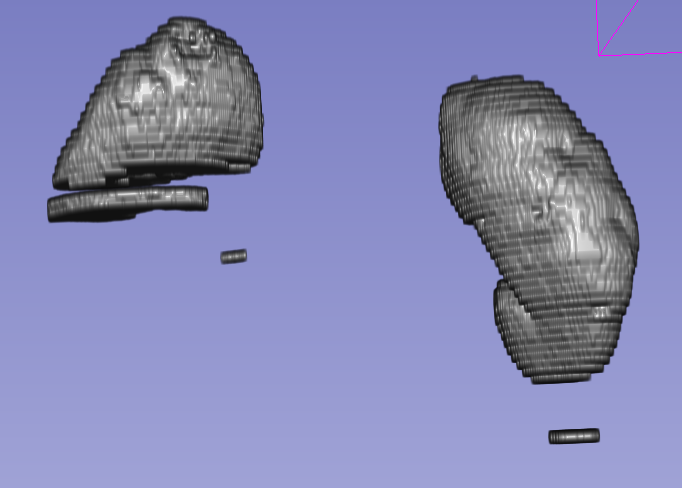

# Kidney Image Segmentation with 2D U-Net

In medical imaging, accurate segmentation of kidney structures is crucial for various diagnostic and therapeutic purposes. One popular approach for automated kidney segmentation is utilizing convolutional neural networks (CNNs), particularly the U-Net architecture.

The U-Net architecture, known for its success in biomedical image segmentation tasks, employs an encoder-decoder framework with skip connections to preserve spatial information. Specifically, the 2D U-Net variant is well-suited for segmenting kidney structures in two-dimensional medical images. The architecture of UNET is depicted below:

### U-Net Architecture

<!--  -->

In this project we will work on a variation of UNET architecture, called EffUNet, where the encoder is a efficient net model. The purpose of this project is to calculate the uncertainty maps of the model in inference to find the anomalies in kidneys, including tumors and cysts. We will train our model on a healthy dataset of kidneys and use the trained model on an unhealthy dataset of kidneys to infer and detect tumors. The first phase is detection of kidneys in images.
The training is on two A6000 GPUS on a parallel mode and took approximately 20 Gigabytes of GPU from each machine.

# How to Run the Project
# Phase 1

## Step 1 (Download Datasets)
First start by downloading the datasets from [TCIA](https://wiki.cancerimagingarchive.net/display/public/pancreas-ct#225140405a525c7710d147e8bfc6611f18577bb7) for healthy kidneys and [kits23](https://github.com/neheller/kits23) for unhealthy datasets.
## Step 2 (Pre-Process)
Run dataset_utils/preprocess_kits.py and dataset_utils/preprocess.py to create the 2d slices of the 3d images for both the healthy and unhealthy datasets. Now healthy_data and unhealthy_data folders are created.
## Step 3 (Model Architecture)
The model architecture uses a variation of UNet where the encoder is EfficientNet and the decoder is the same as the UNet architecture. 
## Step 4 (Model Training)
To train the model run main_train.py file.
## Step 5 (Model Inference)
To perform inference, run inference.py file.
# How to Run the Project:
# Phase 2

## Step 1 (Run MonteCarlo Inference)
To perform inference with Monte Carlo, run mc_inference.py file. 

# Results

<!-- 

 -->

